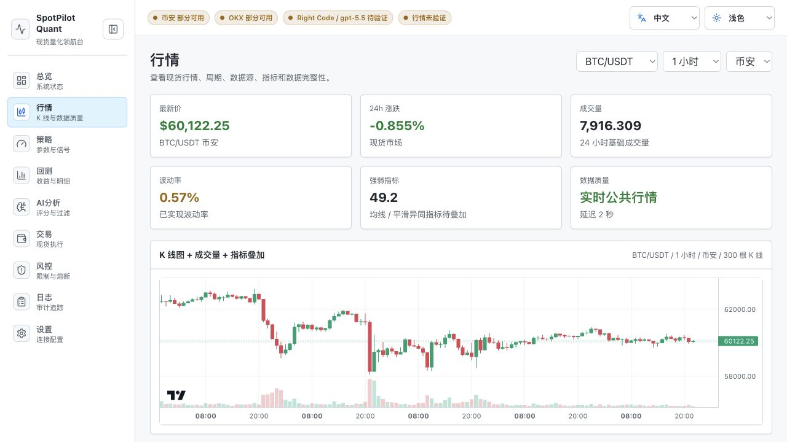
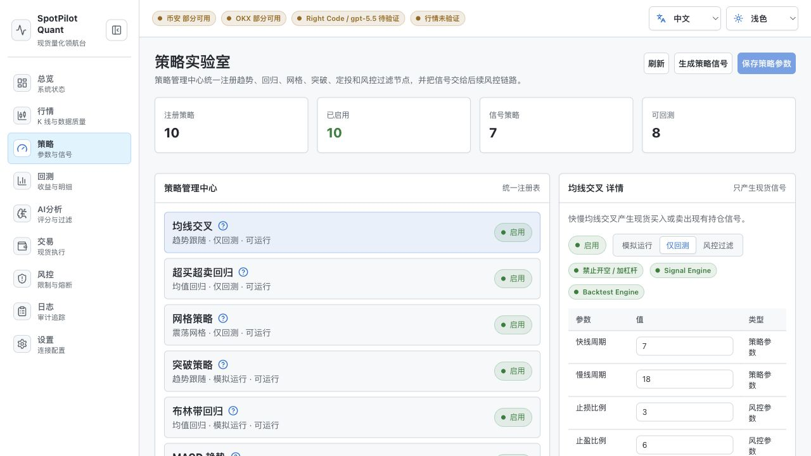
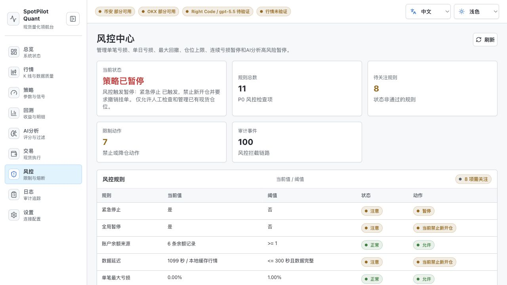
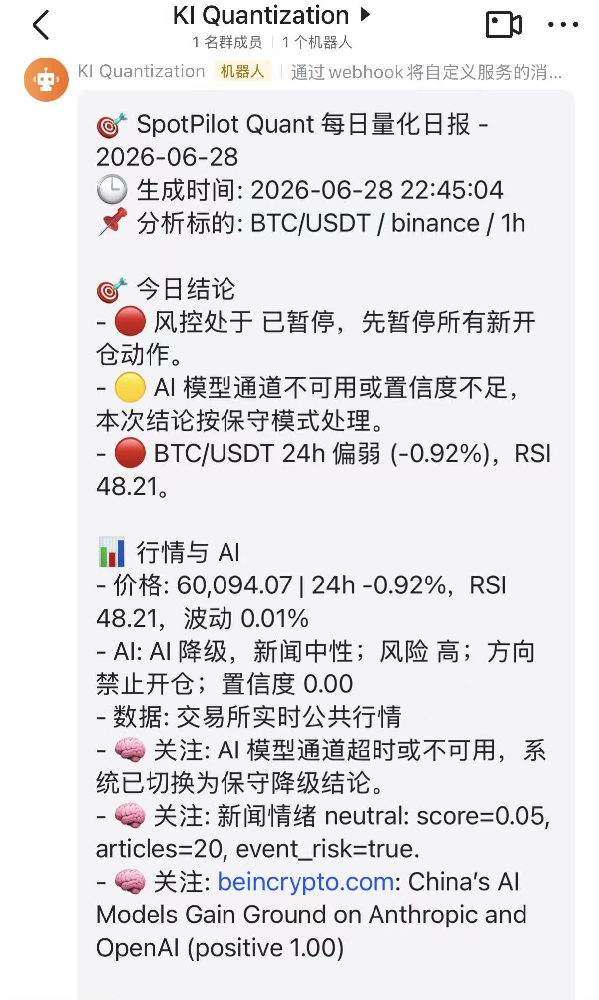

# SpotPilot Quant

<p align="right">
  <strong>中文</strong> | <a href="README.en.md">English</a>
</p>

SpotPilot Quant（现货量化领航台）是一个面向个人研究和本地验证的数字货币现货量化工作台。项目把行情接入、策略信号、AI 分析、回测、风控、交易执行和审计日志放在同一个可运行的前后端系统里，方便在真实交易前完成策略验证、风险检查和操作链路演练。

第一版严格限定为 Spot 现货：策略只产出买入、卖出现有持仓、等待和撤单相关信号；AI 只做分析、解释和过滤，不直接下单；所有交易动作都必须经过风控与显式开关。项目默认以本地 dry-run、回测和可追溯日志为中心，Live 交易能力默认关闭。

> 风险提示：本项目仅用于技术研究、策略验证和个人学习，不构成投资建议。数字货币交易具有高风险，开启真实交易前请自行完成充分测试、权限隔离、资金隔离和风控确认。

## Why This Project

很多量化 Demo 只展示策略公式或回测曲线，但真实交易链路还需要解决行情质量、交易所差异、AI 不确定性、风控拦截、密钥权限、日志追溯和异常降级等问题。SpotPilot Quant 的目标是把这些环节放进一个本地可运行的最小闭环里：

- 用真实交易所公开行情替代静态假数据。
- 用统一策略注册中心管理信号生成和回测能力。
- 用 AI 作为辅助分析节点，而不是绕过风控的自动决策者。
- 用风控、Kill Switch、交易模式开关和审计日志保护真实执行链路。
- 用前端工作台把市场、策略、回测、AI 分析、交易、风险和设置集中起来。

## Features

- **行情工作台**：接入 Binance / OKX Spot 公共行情，支持 ticker、K 线和市场概览。
- **策略中心**：内置 MA Cross、RSI Mean Reversion、Grid Trading 等现货策略适配器。
- **回测引擎**：复用策略注册表进行历史验证，输出收益、回撤、胜率和交易明细。
- **AI 分析**：支持多路模型代理配置，可用于行情解释、策略过滤和结构化风险提示。
- **交易执行**：通过 CCXT 接入 Binance / OKX 私有现货交易接口，Live 模式默认关闭。
- **风险控制**：在开仓、平仓、撤单等操作前执行模式、权限、数据完整性和风控检查。
- **每日推送**：支持将每日量化日报发送到飞书、企业微信、Telegram、Email、Slack 或 Discord。
- **审计日志**：策略信号、AI 过滤、风控判断和订单动作可形成可追溯链路。
- **本地优先**：默认使用本地 MySQL repository，不返回演示资产、演示持仓或虚假订单。

## Screenshots

> 截图来自本地中文界面，展示的是工作台结构、行情图表、策略管理和风控页面。真实账户资产、API Key 和私有订单信息不建议放入公开仓库截图。

### 行情工作台



### 策略实验室



### 风控中心



### 每日推送

飞书机器人可接收每日量化日报，包含分析标的、行情状态、AI 过滤结论、风控动作和重点新闻摘要。



更多页面：

- [回测页面](docs/screenshots/backtest.jpg)
- [项目设置](docs/screenshots/settings.jpg)

## Tech Stack

- **Frontend**：Vue 3、Vite、TypeScript、Pinia、Vue Router、Element Plus、ECharts、Lightweight Charts。
- **Backend**：FastAPI、Pydantic、SQLAlchemy、PyMySQL、HTTPX、CCXT。
- **Infrastructure**：MySQL、Docker Compose、本地 `.env` 配置。
- **Testing / Quality**：Pytest、Ruff 配置、Vue Type Check、ESLint。

## Project Layout

```text
apps/
  api/      FastAPI 后端，负责行情、策略、回测、AI、交易、风控和日志接口
  web/      Vue 3 + Vite 前端工作台
docs/       架构、模块边界和落地说明
infra/      本地 MySQL 等基础设施配置
```

## Current Status

当前项目定位是本地 MVP / 研究型工作台，适合用来学习、二次开发和验证现货量化交易链路。默认不建议直接接入大额资金运行；如果需要真实交易，请先阅读 Safety Boundary，并从小额资金、人工监控和可回滚配置开始逐步验证。

## Local Startup

1. 复制环境变量：

```bash
cp .env.example .env
```

2. 启动 MySQL：

```bash
docker compose -f infra/docker-compose.yml up -d
```

3. 启动后端：

```bash
cd apps/api
python3 -m venv .venv
source .venv/bin/activate
pip install -e ".[dev]"
uvicorn app.main:app --reload --host 0.0.0.0 --port 8001
```

初始化 MySQL Repository：

```bash
python apps/api/scripts/init_db.py
```

公共现货行情默认会尝试调用交易所官方 REST：

- Binance: `GET /api/v3/ticker/24hr`、`GET /api/v3/klines`
- OKX: `GET /api/v5/market/ticker`、`GET /api/v5/market/candles`

如果本机网络无法访问交易所，接口会返回 `data_integrity=exchange_error...`，不会返回假行情，也不会让 API 500。

Spot Live 下单、撤单、手动平仓使用 CCXT 私有接口，必须同时打开全局实盘闸门和单交易所闸门：

```bash
TRADING_MODE=live
LIVE_TRADING_ENABLED=true

BINANCE_API_KEY=你的 Binance API Key
BINANCE_API_SECRET=你的 Binance API Secret
BINANCE_SPOT_TRADING_ENABLED=true
BINANCE_SANDBOX=false

OKX_API_KEY=你的 OKX API Key
OKX_API_SECRET=你的 OKX API Secret
OKX_API_PASSPHRASE=你的 OKX API Passphrase
OKX_SPOT_TRADING_ENABLED=true
OKX_SANDBOX=false
```

只需要接入一个平台时，只打开对应平台的 `*_SPOT_TRADING_ENABLED`。API Key 应只授予现货交易权限，不要开启提现权限。

4. 启动前端：

```bash
npm --prefix apps/web install
npm --prefix apps/web run dev
```

默认前端地址是 `http://localhost:5173`，后端健康检查是 `http://localhost:8001/api/v1/health`。

### 每日推送

后端已内置每日推送调度器，默认关闭。开启后会按本机本地时间生成「每日量化日报」，并发送到已配置的飞书、企业微信、Telegram、Email、Slack 或 Discord 渠道。

```bash
SCHEDULE_ENABLED=true
SCHEDULE_TIME=18:00
SCHEDULE_TIMES=09:00,18:00
SCHEDULE_RUN_IMMEDIATELY=false
```

留空 `SCHEDULE_TIMES` 时会回退到 `SCHEDULE_TIME`。手动触发接口：

```bash
curl -X POST http://localhost:8001/api/v1/settings/notifications/daily-push/run
```

### AI 模型配置

AI 模型配置在项目根目录的 `.env`。不要把真实秘钥写入 `.env.example` 或提交到 Git。

系统保留 `AI_PROXY_A/B/C` 三路通道，每一路都可以配置为 Right Code、OpenAI 兼容、DeepSeek、通义千问、Kimi、GLM、MiniMax、Ollama 本地模型等常见供应商。默认 A 通道继续兼容 Right Code 的 Responses API，B 通道预置 DeepSeek，C 通道预留给任意 OpenAI 兼容服务。

常用供应商模板：

| 服务商 | `AI_PROXY_*_PROVIDER` | `AI_PROXY_*_BASE_URL` | `AI_PROXY_*_MODEL` 示例 | `AI_PROXY_*_API_FORMAT` |
| --- | --- | --- | --- | --- |
| Right Code | `right_code` | `https://www.right.codes/codex/v1` | `gpt-5.5` | `responses` |
| OpenAI 兼容 | `openai_compatible` | `https://api.example.com/v1` | `gpt-5.5` | `chat_completions` |
| OpenAI 官方 | `openai` | `https://api.openai.com/v1` | `gpt-5.5` | `chat_completions` |
| DeepSeek 官方 | `deepseek` | `https://api.deepseek.com` | `deepseek-v4-pro` | `chat_completions` |
| 通义千问 | `dashscope` | `https://dashscope.aliyuncs.com/compatible-mode/v1` | `qwen3.7-max` | `chat_completions` |
| Kimi / 月之暗面 | `moonshot` | `https://api.moonshot.ai/v1` | `kimi-k2.7-code` | `chat_completions` |
| Z.AI / 智谱 GLM | `zhipu` | `https://api.z.ai/api/paas/v4` | `glm-5.2` | `chat_completions` |
| MiniMax 官方 | `minimax` | `https://api.minimax.io/v1` | `MiniMax-M3` | `chat_completions` |
| Ollama 本地 | `ollama` | `http://127.0.0.1:11434/v1` | `qwen3.6` | `chat_completions` |
| AIHubMix | `aihubmix` | `https://aihubmix.com/v1` | `gpt-5.5` | `chat_completions` |
| OpenRouter | `openrouter` | `https://openrouter.ai/api/v1` | `~openai/gpt-latest` | `chat_completions` |
| 硅基流动 | `siliconflow` | `https://api.siliconflow.cn/v1` | `Qwen/Qwen3.6-35B-A3B` | `chat_completions` |

DashScope 官方也提供带 WorkspaceId 的新版兼容地址，设置页默认保留 `dashscope.aliyuncs.com` 旧版兼容域名，方便用户直接填写；如账号要求工作空间专属域名，可在 Base URL 中替换。

启用 DeepSeek 作为 B 备用通道示例：

```bash
AI_PROXY_B_BASE_URL=https://api.deepseek.com
AI_PROXY_B_PROVIDER=deepseek
AI_PROXY_B_API_KEY=你的 DeepSeek API Key
AI_PROXY_B_MODEL=deepseek-v4-pro
AI_PROXY_B_PRIORITY=2
AI_PROXY_B_ENABLED=true
AI_PROXY_B_API_FORMAT=chat_completions
```

启用本地 Ollama 示例：

```bash
AI_PROXY_C_BASE_URL=http://127.0.0.1:11434/v1
AI_PROXY_C_PROVIDER=ollama
AI_PROXY_C_API_KEY=
AI_PROXY_C_MODEL=qwen3.6
AI_PROXY_C_PRIORITY=3
AI_PROXY_C_ENABLED=true
AI_PROXY_C_API_FORMAT=chat_completions
```

Ollama 本地通道通常不需要 API Key；其他云端供应商需要填写对应 Key。设置页可对单个通道执行“测试连接”，系统会使用当前表单里的服务商、Base URL、接口协议、模型和 API Key 发起一次轻量模型调用，并校验是否返回有效结构化 JSON。系统会按 `AI_PROXY_*_PRIORITY` 从小到大调用。任一模型通道超时、HTTP 失败、返回非 JSON 或结构化字段校验失败时，会自动尝试下一个可用通道；全部不可用时，AI 分析接口返回 503，交易链路不会继续开新仓。

测试时可以用下面的命令一键启动或重启前后端：

```bash
npm run test:dev:start
npm run test:dev:restart
```

这两个命令默认使用后端 `8001`、前端 `5173`，运行日志分别写入 `logs/api-dev.log` 和 `logs/web-dev.log`。如需临时改端口，可以传入 `API_PORT` 或 `WEB_PORT` 环境变量。

默认不会返回演示资产、持仓或订单。默认 `REPOSITORY_BACKEND=mysql` 会从 MySQL 表读取真实配置、订单、持仓、风控和日志；如显式切到 `memory`，则只使用内存空仓库且重启后数据丢失。Market 接口只返回真实公共行情或明确的交易所错误状态。

## Development Commands

```bash
npm run build:web
npm run lint:web
npm run typecheck:web
npm run test:api
npm run check:api
```

## Architecture

详细设计见 [docs/architecture.md](docs/architecture.md)。整体链路如下：

```text
Market Data -> Strategy Signal -> AI Filter -> Risk Engine -> Execution Engine -> Audit Logs
                     |                               |
                     +---------- Backtesting --------+
```

后端采用分层结构：

- `api/v1/routes`：HTTP 路由，只处理协议转换。
- `application`：策略、AI、回测、交易、风控等应用编排。
- `domain`：Pydantic 契约、领域模型和枚举。
- `infrastructure`：交易所 adapter、MySQL schema、repository 和外部服务适配。

前端按业务页面拆分：

- Dashboard、Market、Strategy、Backtest、AI Analysis、Trading、Risk、Settings。
- `shared` 放置 API client、基础组件、格式化工具和类型定义。

## Safety Boundary

- Live 模式默认关闭，必须通过环境变量和二次确认流程显式启用。
- 禁止合约、永续、杠杆、保证金和裸空能力进入第一版执行链路。
- 数据延迟、AI 模型通道不可用、交易所异常和风控触发时，系统必须阻止新开仓。
- 每一次策略信号、AI 过滤、风控判断和订单动作都需要形成可追溯链路。

## Roadmap

- 更完整的策略参数管理和可视化回测报告。
- 更严格的 Live 交易验收清单、模拟盘模式和资金保护策略。
- 更多交易所行情 adapter 和更细粒度的数据完整性检查。
- 更完善的审计日志检索、导出和日报模板。
- CI 工作流：前端构建、后端测试、类型检查和基础安全扫描。

## Disclaimer

本项目不保证收益，不保证策略有效性，也不保证第三方交易所、AI 服务或网络环境的稳定性。任何真实交易决策与资金损失均由使用者自行承担。

## License

本项目基于 MIT License 开源。二次开发、分发或商业使用时，请保留版权声明和许可证信息：

```text
Copyright (c) 2026 Kairo
```
