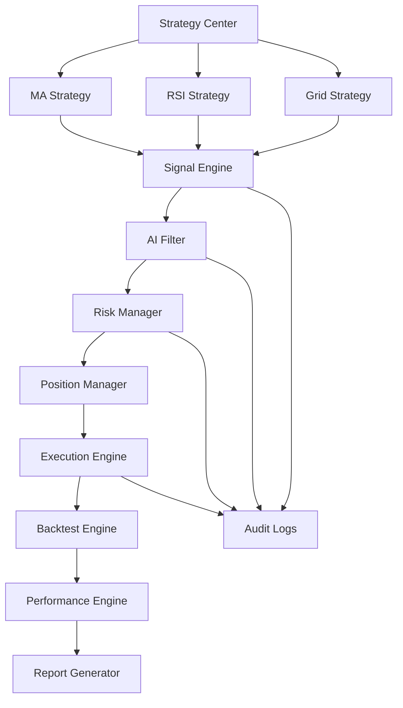

# Enterprise Architecture

## Architecture Goals

- 明确分层：前端展示、API 编排、领域服务、基础设施适配分开演进。
- 明确安全边界：第一版只支持 Spot 现货，不把合约、杠杆、保证金能力放入任何默认路径。
- 明确可追溯链路：策略信号、AI 分析、风控判断、交易执行和日志共享同一条 correlation id。
- 明确本地验证定位：优先 dry-run、回测、AI adapter 测试替身和本地 MySQL，真实交易接入需要单独强化验收。

## Backend Layers

```text
apps/api/app
  main.py              FastAPI 入口、CORS、全局路由
  core/                配置、枚举、日志和安全常量
  api/v1/routes/       HTTP/WebSocket 路由层，只做协议转换
  domain/              Pydantic 契约和领域枚举
  application/         应用服务和 Repository 端口，编排策略、AI、风控和交易
  infrastructure/      Binance/OKX 公共行情、MySQL schema、repository、后续 CCXT、AI proxy、飞书等适配器
```

## Frontend Layers

```text
apps/web/src
  app/                 router、全局 store、应用 bootstrap
  layouts/             工作台外壳：顶部状态栏、左侧导航、主内容
  shared/              API client、基础组件、类型契约
  features/            按 PRD 页面拆分 Dashboard/Market/Strategy/...
  styles/              全局设计 token 和响应式布局
```

## MVP Data Flow



## Strategy Architecture

策略模块由 `StrategyRegistry` 作为管理中心。每个策略实现统一适配器：默认配置、信号生成、回测入口和能力标记都从注册表暴露，前端策略页和回测页不再维护单独的策略枚举。

- `MA Cross`：趋势跟随，支持 Signal Engine 和 Backtest Engine。
- `RSI Mean Reversion`：均值回归，支持 Signal Engine 和 Backtest Engine。
- `Grid Trading`：震荡网格，支持 Signal Engine 和 Backtest Engine，现货固定份额低买高卖。
- `AI Filter`：风险过滤节点，不直接生成订单，不参与回测。

新增策略时优先在 `apps/api/app/application/strategies.py` 增加一个适配器并注册到 `default_strategy_registry()`；策略参数校验、信号原因和回测参数转换应留在适配器内，`WorkbenchApplicationService` 只做编排。

## API Contract

所有接口挂在 `/api/v1` 下。默认不返回假资产、假持仓或假订单；`REPOSITORY_BACKEND=mysql` 从 MySQL repository 读取真实数据，显式切到 `memory` 时返回内存空仓库结果。Market 接口会优先尝试 Binance/OKX 公共现货行情，失败时返回 `exchange_error`。

- `GET /health`
- `GET /system/status`
- `GET /dashboard`
- `GET /market/overview`
- `GET /strategies`
- `POST /strategies/signals/run`
- `POST /backtests/run`
- `GET /ai-analysis/latest`
- `GET /trading/summary`
- `GET /risk/status`
- `GET /logs`
- `GET /settings/summary`

## Release Gates

- `npm --prefix apps/web run build`
- `cd apps/api && python3 -m compileall app tests`
- Live 相关功能必须额外通过 Spot 权限、IP 白名单、提现权限关闭、Kill Switch 和日志审计检查。
